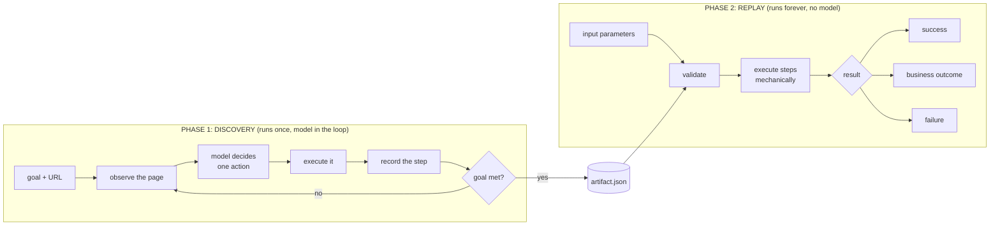
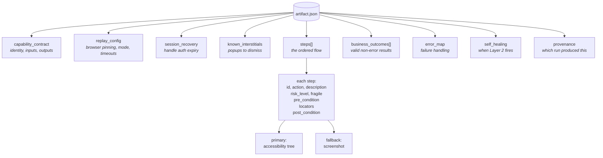
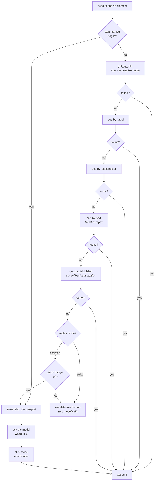
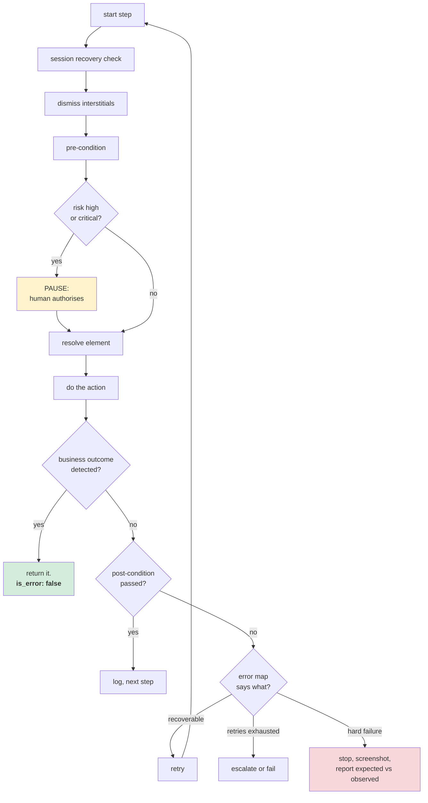
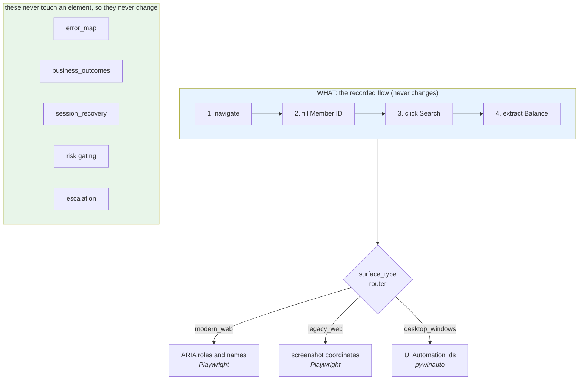
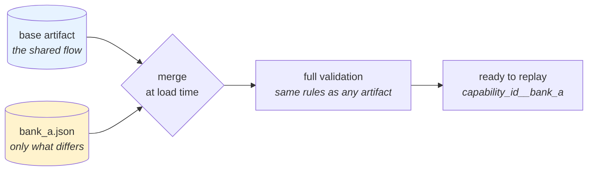
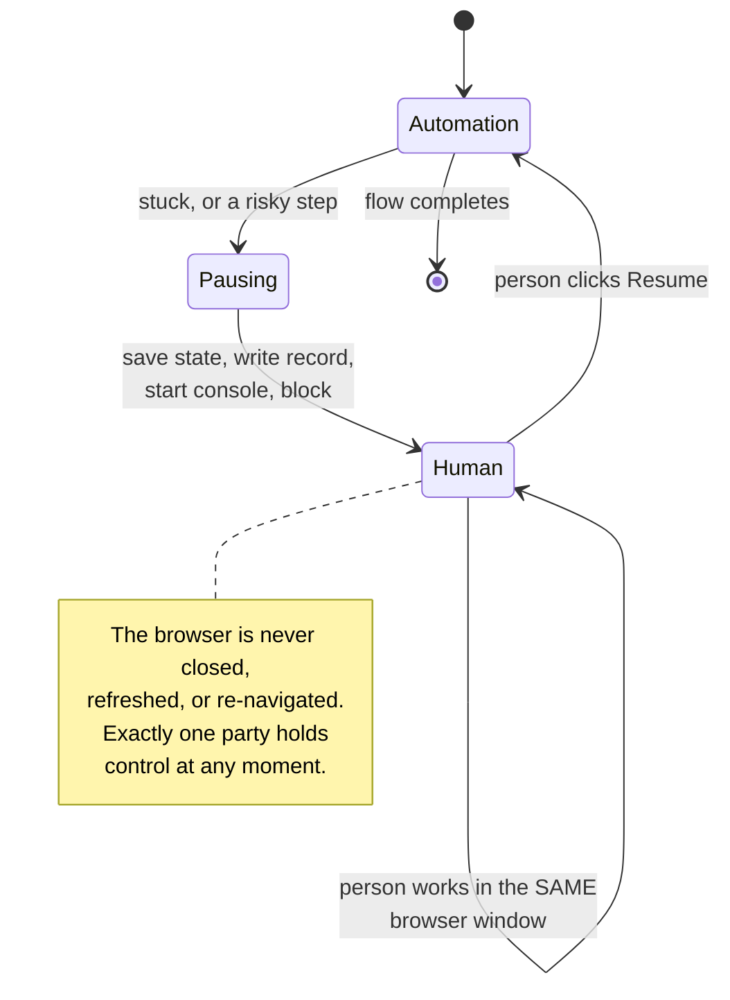
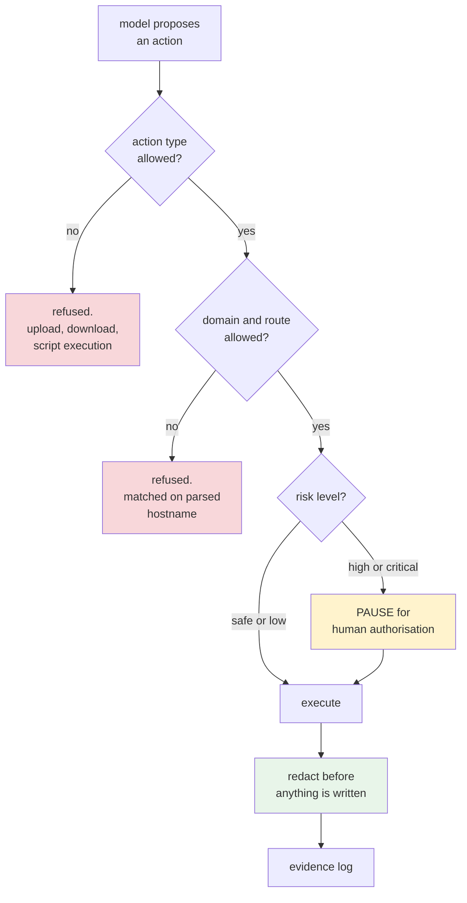

# REPORT: Blueprint Agent

Design write-up for the computer-use automation take-home.

> **The model discovers. The artifact becomes a reusable capability. Deterministic
> replay is how the agent invokes it in production.**

**Repo:** <https://github.com/shivamshinde123/blueprint-agent>  
**Targets:** saucedemo.com (modern web), demo.guru99.com (legacy web)  
**Model:** `anthropic/claude-sonnet-5` via OpenRouter  
**Tests:** 346 passing, lint clean  

Every claim in this report is backed by a committed evidence file or a test.
Where something is designed but not demonstrated, it says so.

### Contents

1. [Architecture](#1-architecture)
2. [Artifact Schema](#2-artifact-schema) (the longest section, and the centre of the design)
3. [Determinism and Error Handling](#3-determinism-and-error-handling)
4. [Heterogeneity and Multi-Tenant](#4-heterogeneity-and-multi-tenant)
5. [Escalation and Handoff](#5-escalation-and-handoff)
6. [Safety](#6-safety)
7. [Cuts](#7-cuts)
8. [Appendix: what running it taught](#appendix-what-running-it-taught)

---

## 1. Architecture

### Two phases

**Discovery** puts a model in the loop against a live browser. It looks at the
page, decides one action, does it, records what worked, and repeats until the
goal is met. It runs once per capability.

**Replay** reads the recorded artifact and executes it mechanically. In strict
mode, which is the default, no model is contacted at all.



### Why the model only runs once

The key design question is: **how often does the model run?**

There are two ways to build a system like this.

**Option A: the model runs every time.** Someone asks for a product price, and
the model opens the browser, looks at the page, and works out what to click,
from scratch, every single time.

**Option B: the model runs once.** It works out the flow one time, and that
flow is saved. Every use after that just follows the saved steps.

This project does Option B, and here are the real numbers from the runs in this
repository:

| | Model runs every time | Model runs once (this project) |
|---|---|---|
| Time per use | Minutes | **8.7 seconds** |
| Model calls per use | 7 or more | **0** |
| Cost per use | Paid every time | Paid once, ever |
| Same input, same result? | Not guaranteed | **Yes, verified twice** |

The third row is a business problem and the fourth is a correctness problem. A
model can reasonably pick a different route through the same website on two
different days. Both routes might work. But if a bank is running this a thousand
times a day, "it usually works" is not good enough, and "it did something
slightly different today" is impossible to debug.

So the model is used for the thing it is genuinely good at, which is *working
out* how an unfamiliar website behaves. Then its answer is written down and the
model is taken out of the loop.

**Where the two halves meet is the artifact.** Discovery is allowed to be
unpredictable, because a person reviews what it produced before anyone relies on
it. Replay is not allowed to be unpredictable, because nobody is watching it
run.

### What has been demonstrated

```
recorded with  "Sauce Labs Backpack"    ->  $29.99   6/6 steps, 0 model calls
replayed with  "Sauce Labs Bike Light"  ->  $9.99    6/6 steps, 0 model calls
```

Each returned its own correct description. Evidence:
`evidence/discovery_run_saucedemo.json`,
`evidence/replay_run_sauce_labs_backpack.json`,
`evidence/replay_run_sauce_labs_bike_light.json`.

The second line is the one that matters. Replaying with the value it was
recorded with only proves the transcript replays. Replaying with a *different*
value is what separates a reusable capability from a recording. Section 3
describes the three ways I got that wrong before getting it right.

### Component map

| Module | Responsibility |
|---|---|
| `src/agent/discovery.py` | The observe, decide, act loop and the step recorder |
| `src/agent/observation.py` | Reading the page, and diffing before against after |
| `src/agent/prompts.py` | Every prompt, in one place, byte-stable so it can be cached |
| `src/agent/decisions.py` | Typed shapes the model returns, sent as a strict JSON schema |
| `src/artifact/schema.py` | The artifact: 21 enums, 24 models, all validation |
| `src/artifact/reusability.py` | The one rule that keeps a capability reusable |
| `src/artifact/validator.py` | Pre-flight: load, parameters, escalation, browser match |
| `src/artifact/merge.py` | Base artifact plus per-tenant override |
| `src/replay/engine.py` | The deterministic executor |
| `src/replay/locator.py` | **The only module that knows how an element is found** |
| `src/replay/conditions.py` | Evaluating checkpoints. Waits on state, never on a clock |
| `src/replay/error_handler.py` | The three error categories and retry accounting |
| `src/safety/` | Allowlist, risk gating, redaction |
| `src/escalation/` | Handoff manager and operator console |
| `src/session/browser.py` | The pinned browser context, enforced in one place |
| `src/llm/client.py` | The only module aware a model provider exists |

Two of those are narrow on purpose. `locator.py` is the seam that makes the
desktop story in section 4 believable. `llm/client.py` is why swapping models is
a config change.

### Target applications

**saucedemo.com** is a modern React store. It exercises the accessibility-tree
path.

I chose it after abandoning **OrangeHRM**, which was my first pick. Its demo
data resets, so the employee I was asked to look up stopped existing partway
through the work. Its employee search is a typeahead that silently rejects any
value not picked from its dropdown. And 7 of 15 profile pages timed out while I
was probing it. Building a graded deliverable on that was a risk with no upside.

**demo.guru99.com** is a genuinely legacy bank: table-based layout, form inputs
with no accessible name. It is here to force the screenshot fallback to do real
work, and it did (sections 5 and 8).

**A local zero-ARIA mock** (`mock/legacy_bank.html`) backs the legacy story in
the test suite, so the Layer 2 tests do not depend on a public demo site being
up. Two tests check the mock's premise instead of assuming it: a well-built page
resolves by role, label, and placeholder, and the mock resolves by none of them.
If the mock ever drifts into being accessible, that test fails and says so.

### Model access

Models are reached through **OpenRouter**, an OpenAI-compatible gateway, so
trying a different model is a config change rather than a rewrite:

```bash
BLUEPRINT_MODEL=google/gemini-3-pro uv run python main.py discover ...
```

Nothing outside `src/llm/` imports a provider SDK.

Routing is **pinned** to one upstream provider, with gateway fallback turned
off. A gateway quietly switching providers mid-run is the wrong failure mode for
a system built on reproducibility: two runs of the same configuration could be
served by different infrastructure. The serving provider and the generation id
are recorded for every call, so any discovery run can be traced afterwards.

### Trade-offs taken

| Decision | Cost | Why anyway |
|---|---|---|
| Strict mode holds *no* model client | Cannot self-heal mid-run | "Zero model calls" becomes structural, not a promise. No later edit can add one by accident |
| Reject an artifact that embeds run data | Discovery fails more often | A silently wrong capability is worse than a failed recording |
| Accessibility-first locators | More work than CSS selectors | Identity survives a redesign. Position and DOM structure do not |
| One model for text and vision | Not the cheapest per call | One integration, one failure mode, one thing to reason about |
| Validate everything at load | A longer, stricter schema | A bad artifact fails before the browser opens, not at step 6 with five real actions already taken |

---

## 2. Artifact Schema

The artifact is the central design object. Everything else either produces one
or consumes one.

### 2.1 What it has to be

Five properties, each of which drove real schema decisions:

| Property | Why it matters | How the schema delivers it |
|---|---|---|
| **Executable** | Replay must run it with no model | Every field the engine needs is explicit. Nothing is inferred |
| **Reusable** | It must work for inputs it never saw | `{{param}}` templates, plus the reusability rule in section 3 |
| **Reviewable** | A human must be able to audit it | Readable descriptions, explicit nulls, no magic |
| **Versioned** | It is a capability, not a script | semver, `schema_version`, provenance with a content hash |
| **Safe by construction** | It drives banking software | Risk levels, sensitivity flags, load-time validation |

### 2.2 Anatomy



### 2.3 Capability contract

Real, taken from `artifacts/lookup_product_price_v1.0.0.json`:

```json
{
  "capability_id": "lookup_product_price",
  "version": "1.0.0",
  "schema_version": "1.0.0",
  "description": "Log in to the store, open the product with the given name, and get its price and description.",
  "recorded_by": "agent",
  "created_at": "2026-08-20",
  "surface_type": "modern_web",
  "target": {
    "app_name": "saucedemo",
    "url": "https://www.saucedemo.com",
    "surface_type": "modern_web"
  },
  "input_parameters": {
    "product_name":  { "type": "string", "required": true, "sensitive": false },
    "auth_username": { "type": "string", "required": true, "sensitive": true  },
    "auth_password": { "type": "string", "required": true, "sensitive": true  }
  },
  "output_schema": {
    "description": "string",
    "price": "currency"
  }
}
```

| Field | Rule | Why |
|---|---|---|
| `capability_id` | `snake_case` | It is an identifier an agent calls, not prose |
| `version` | strict semver | Minor for locator changes, major for flow changes |
| `schema_version` | strict semver | The schema contract, versioned separately from the artifact |
| `surface_type` | one of four values | Routes locator resolution (section 4) |
| `recorded_by` | `agent` or `human_operator` | Provenance for review |
| `input_parameters[].sensitive` | **strict boolean** | See below |
| `output_schema` | must equal the set of extracted keys | Otherwise a "success" quietly drops a promised field |

`sensitive` is checked as a **strict boolean**, not just typed as one. Pydantic
would happily convert the string `"no"`, which is truthy, and quietly switch off
redaction on a real password. The validator rejects `"true"`, `"yes"`, `1`, `0`
and anything else that is not a real boolean.

### 2.4 Replay configuration

```json
"replay_config": {
  "browser": {
    "viewport": { "width": 1280, "height": 720 },
    "device_scale_factor": 1,
    "is_mobile": false,
    "headless": false,
    "locale": "en-US",
    "timezone_id": "UTC",
    "reduced_motion": "reduce",
    "enforce_strictly": true
  },
  "mode": "strict",
  "default_timeout_ms": 8000,
  "interstitial_probe_timeout_ms": 250,
  "max_retries_per_step": 3,
  "retry_wait_ms": 1000,
  "max_llm_calls_per_replay": 3
}
```

**Why the browser block is this big.** Layer 2 stores pixel coordinates, and
pixels move for more reasons than window size:

- `device_scale_factor`: a device pixel ratio of 2 doubles every coordinate.
- `headless`: headless and headful Chromium draw fonts differently and disagree
  about scrollbar width.
- `locale`: changes text length, which reflows the layout.
- `reduced_motion`: a screenshot taken during an animation disagrees with one
  taken after it settles.

At replay the live browser is measured *from the page itself* and compared
against this block. A mismatch is refused before any action runs. Measuring from
the page rather than trusting the launch options is on purpose: the point is to
catch a browser that did not honour the request.

**`interstitial_probe_timeout_ms` is separate from `default_timeout_ms`, and
much shorter.** Interstitials are checked before every step. At the full action
timeout, three interstitials across eight steps would add minutes of dead
waiting to a flow that should take seconds.

**`mode`** is `strict` by default, meaning no model calls at all. `assisted`
allows a limited number of vision calls for *finding an element only*. The step
sequence still comes entirely from the artifact, so the model is never making
decisions.

### 2.5 Steps

| Field | Type | Required | Notes |
|---|---|---|---|
| `step_id` | int | yes | Sequential from 1. Referenced by `error_map.step_N` |
| `action` | `click`, `fill`, `navigate`, `extract` | yes | |
| `description` | string | yes | Shown to the operator during a handoff, so write it for them |
| `fragile` | bool | yes | `true` skips Layer 1 completely |
| `fragile_reason` | string | when fragile | Why the accessibility tree was no use here |
| `risk_level` | `safe`, `low`, `high`, `critical` | yes | high and critical always pause for a human |
| `pre_condition` | Condition or **explicit null** | no | Never left out. An explicit null shows it was a decision |
| `locators` | Locators or null | no | Null on extract steps, which carry per-extraction locators |
| `url` | string | navigate only | |
| `value` | string | fill only | May contain `{{param}}` |
| `extractions` | Extraction[] | extract only | |
| `post_condition` | Condition | yes | **Required on every step** |
| `step_wait_ms` | int | no | Settle time after the checkpoint passes. Not a sleep |

A real `click` step. Note the parameterised name, the two-method chain, the
explicit `nth`, and the free Layer 2 fallback:

```json
{
  "step_id": 5,
  "action": "click",
  "description": "Login succeeded and inventory page is shown. Now click the product link matching the parameterized product name to open its detail page.",
  "fragile": false,
  "risk_level": "safe",
  "pre_condition": {
    "condition": "element_visible",
    "locators": { "...": "same as below" },
    "timeout_ms": 8000,
    "on_fail": "retry"
  },
  "locators": {
    "primary": {
      "strategy": "accessibility_tree",
      "available": true,
      "methods": [
        { "method": "get_by_role", "role": "link", "name": "{{product_name}}", "nth": 0 },
        { "method": "get_by_text", "value": "{{product_name}}" }
      ]
    },
    "fallback": {
      "strategy": "screenshot",
      "coordinates": { "x": 178, "y": 274 },
      "scroll_y": 0,
      "viewport": { "width": 1280, "height": 720 },
      "visual_description": "The product title link in the inventory list, displayed as blue text under the product image, matching the given product name."
    }
  },
  "post_condition": {
    "condition": "page_contains_text",
    "value": "Go back",
    "timeout_ms": 8000,
    "on_fail": "retry"
  }
}
```

Look at `"name": "{{product_name}}"`. The locator *depends on* the input instead
of naming one product. That one choice is what lets the artifact find the Bike
Light after being recorded against the Backpack.

`post_condition` is required on every step, because you should never move on
without checking the action did something. `pre_condition` is written as an
explicit `null` where none makes sense, so a reader can tell it was left out on
purpose rather than forgotten.

### 2.6 The locator model

This is where most of the design effort went, because it is where real
applications fight back.



**The golden rule: find elements by identity, not position.** Identity survives
a redesign. Coordinates do not.

#### Layer 1 methods

| Method | Matches on | Example |
|---|---|---|
| `get_by_role` | ARIA role **and** accessible name | `{"method":"get_by_role","role":"button","name":"Login"}` |
| `get_by_label` | An associated `<label>` | `{"method":"get_by_label","name":"Employee Id"}` |
| `get_by_placeholder` | Placeholder text | `{"method":"get_by_placeholder","value":"Username"}` |
| `get_by_text` | Visible text, or a **regex** | `{"method":"get_by_text","pattern":"\\$[\\d,.]+"}` |
| `get_by_field_label` | The control beside an *unwired* caption | `{"method":"get_by_field_label","name":"Date of Birth"}` |

The last two exist because real markup demanded them.

**`get_by_field_label`.** A caption is only reachable by `get_by_label` if the
markup actually connects it to its control, and plenty of applications never do
that. One target rendered a visible "Date of Birth" label whose input had no
accessible name at all. Every name-based method returned nothing, while a human
reads it instantly. This method walks up from the label to the nearest ancestor
that contains a control, then back down to it. That is how a person reads a
form: the box under or beside the words. It is still identity-based, because it
keys on the caption a person can see.

**Shape addressing**, which is `get_by_text` with a `pattern`. This is the last
resort for a value with **no label, no role, and whose own text is the value you
are trying to read**. A price in a bare `<div>` cannot be named without naming
the price, which is circular and banned. `\$[\d,.]+` finds it on any product
page, for any price, without naming one.

#### Ambiguity is resolved and written down

Real pages repeat labels. One search form had **two** visible inputs sharing the
placeholder `"Type for hints..."`. Refusing the step is unhelpful. Guessing
again on every run is worse. So the chosen index is recorded:

```json
{ "method": "get_by_role", "role": "link", "name": "{{product_name}}", "nth": 0 }
```

An explicit `nth` also lets `get_by_role` skip the name entirely. "The first
option in a suggestion list" is a stable choice when the option's text is this
run's data. The validator allows a role without a name only when `nth` is
present, so a positional choice is always a recorded decision rather than an
accident of ordering.

#### The fallback is recorded for every step, and costs nothing

When Layer 1 finds an element, Playwright is already holding the handle, so
`bounding_box()` gives the centre point **with no vision call**. A complete
safety net for free was too good to skip.

Two details carry weight:

- Coordinates are **viewport-relative**, taken from a viewport-only screenshot.
  A full-page screenshot stitches the whole scrollable document, so its y values
  do not map to `mouse.click`. The click would land somewhere else entirely, and
  silently.
- `scroll_y` is stored next to them, because a coordinate only points at the
  right element at the scroll position it was captured at.

#### A fragile step

When no accessibility method can find an element, which is normal on a legacy
surface, the step is recorded as fragile with Layer 1 switched off. Replay then
does not waste a timeout retrying a layer that was already proved useless:

```json
{
  "step_id": 3,
  "action": "fill",
  "fragile": true,
  "fragile_reason": "no accessibility method could resolve this element; the surface exposes no usable name, role or label for it",
  "locators": {
    "primary":  { "strategy": "accessibility_tree", "available": false, "methods": [] },
    "fallback": { "strategy": "screenshot", "coordinates": {"x": 412, "y": 268},
                  "scroll_y": 0, "viewport": {"width":1280,"height":720},
                  "visual_description": "User ID input, first field in the login table" }
  }
}
```

The schema enforces the whole coupling. `fragile: true` requires a reason,
requires `available: false`, and requires a fallback, because without one there
is no way to find the element at all.

### 2.7 Conditions

| `condition` | Operand | Meaning |
|---|---|---|
| `url_contains` | `value` | The URL contains the string |
| `url_not_contains` | `value` | It does not. Used in session recovery |
| `page_contains_text` | `value` | The text is present on the page |
| `element_visible` | `locators` | The element is on screen |
| `element_has_value` | `locators` and `value` | The field holds that value |
| `all_extractions_non_empty` | neither | Every extracted value is non-empty |

```json
{
  "condition": "element_has_value",
  "value": "{{auth_username}}",
  "locators": { "primary": { "available": true, "methods": [
      { "method": "get_by_placeholder", "value": "Username" } ] } },
  "timeout_ms": 4000,
  "on_fail": "retry"
}
```

`on_fail` is one of `hard_failure`, `retry`, `escalate_human`, or
`on_recovery_fail`. The last is only legal inside `session_recovery`.

**Every condition waits for a state, with a timeout. The replay engine sleeps
nowhere.** A fixed wait is both slower than needed when the page is quick, and
unreliable when it is not.

`page_contains_text` checks the visible body text **and** the accessibility
tree. Checkpoints are built from the accessibility snapshot, where an accessible
name can come from an `alt` attribute that never appears as visible text. A
recorded checkpoint of `"Go back"` on a page whose button *reads* "Back to
products" failed against body text alone, while describing the page perfectly.
Both are honest views of a page, so both count. A test confirms that text which
is genuinely absent still fails.

`element_has_value` never copies the actual value into its `observed` field. It
is used on password fields, and `observed` is written to the evidence log.

### 2.8 Extractions

```json
{
  "output_key": "price",
  "locators": {
    "primary": { "strategy": "accessibility_tree", "available": true,
      "methods": [ { "method": "get_by_text", "pattern": "\\$[\\d,.]+" } ] },
    "fallback": { "strategy": "screenshot", "coordinates": {"x":566,"y":307},
      "scroll_y": 0, "viewport": {"width":1280,"height":720},
      "visual_description": "value for price" }
  },
  "extract_method": "text_content",
  "expected_type": "currency",
  "required": true,
  "pattern": "\\$[\\d,.]+"
}
```

| Field | Purpose |
|---|---|
| `output_key` | `snake_case`, and must match `output_schema` exactly |
| `extract_method` | `get_value` (an input's value), `text_content`, or `inner_text` |
| `expected_type` | `string`, `integer`, `currency`, or `boolean` |
| `pattern` | Regex picking the value out of the element's text |
| `required` | Empty and required means a hard failure |

**Two different patterns appear here and they do different jobs.** The one
inside `locators` says *which element* to find. The one on the extraction says
*which part of its text* is the value. Both describe the **shape** of a value
and never the value itself, and the reusability check holds them to that:
`\$[\d,.]+` is fine, `\$29\.99` is rejected.

`pattern` exists because "one element holds one value" is not true of real
pages. With one capture group, the group is taken. Otherwise the whole match is.
The schema checks the pattern compiles and has at most one group, so it is never
ambiguous which part is the value.

**`currency` has a real normalisation contract**, because otherwise the declared
type is decoration and the caller gets a string it cannot parse:

```json
"price": { "raw": "$29.99", "normalized": "29.99" }
```

Symbols and thousands separators are stripped, the result is parsed as a
`Decimal`, and accounting negatives are handled, so `($1,200.00)` becomes
`-1200.00`. Anything unparseable is a hard failure, not a silent pass-through.

Here is the model's own recorded reasoning for that extract step. It reached the
same conclusion I did after probing the DOM by hand:

> *"The description and price live in separate DOM elements
> (inventory_details_desc and inventory_details_price) even though the
> accessibility snapshot merges their text with the product name."*

### 2.9 Business outcomes

A known, valid, non-error result. "No records found" is an **answer**.

```json
{
  "step_ids": [7, 8],
  "name": "Cart is empty",
  "detect": { "condition": "page_contains_text", "value": "Your cart is empty",
              "timeout_ms": 4000, "on_fail": "retry" },
  "outcome_code": "CART_EMPTY",
  "outcome_message": "The product was not added, so the cart holds no line item.",
  "is_error": false,
  "return_value": { "item_name": null, "item_price": null }
}
```

There is deliberately **no `action` field**. The engine always returns the
outcome automatically, so an action field would only be a chance to record a
wrong value. `is_error` is validated as always `false`. `step_ids` is a list, so
one outcome can be checked at several steps without being duplicated.
`return_value` must match `output_schema` **exactly**, so a caller always gets
the same shape whatever the result type.

### 2.10 Error map

Keys are `_default` or `step_N`. A per-step entry overrides the default for that
step. Error type keys come from a fixed list and are never invented.

```json
"error_map": {
  "_default": {
    "element_not_found": { "category": "recoverable", "action": "retry",
      "max_retries": 3, "retry_wait_ms": 1000, "on_exhausted": "escalate_human" },
    "checkpoint_failed": { "category": "recoverable", "action": "retry",
      "max_retries": 2, "retry_wait_ms": 1000, "on_exhausted": "hard_failure" },
    "session_expired":   { "category": "recoverable", "action": "re_login",
      "max_retries": 1, "on_exhausted": "escalate_human" },
    "wrong_page_state":  { "category": "hard_failure", "action": "stop",
      "capture_screenshot": true,
      "message": "The page was not in the expected state and could not be recovered." }
  },
  "step_8": {
    "extraction_empty": { "category": "hard_failure", "action": "stop",
      "capture_screenshot": true,
      "message": "The cart rendered but a line item field was empty." }
  }
}
```

A `hard_failure` handler **must** set `capture_screenshot: true`. A failure with
no visual evidence cannot be debugged afterwards, and the schema enforces this.
A `recoverable` handler **must** declare `on_exhausted`, so the engine always
knows what happens when the retries run out.

### 2.11 Session recovery

A check that runs before every step. The recovery steps are a small script that
runs as one unit. They leave out `step_id`, `risk_level`, `fragile`, and
per-step conditions on purpose, and share one `recovery_post_condition` instead.
They are not part of the main flow and the error map never refers to them.

```json
"session_recovery": {
  "detect_conditions": [
    { "condition": "url_contains", "value": "/auth/login", "on_fail": "retry" }
  ],
  "recovery_steps": [
    { "action": "fill",  "value": "{{auth_username}}", "locators": { "...": "..." } },
    { "action": "fill",  "value": "{{auth_password}}", "locators": { "...": "..." } },
    { "action": "click", "locators": { "...": "..." } }
  ],
  "recovery_post_condition": {
    "condition": "url_not_contains", "value": "/auth/login",
    "timeout_ms": 8000, "on_fail": "on_recovery_fail"
  },
  "after_recovery": "restart_from_current_step",
  "max_recovery_attempts": 1,
  "on_recovery_fail": "escalate_human"
}
```

`after_recovery` is nearly always `restart_from_current_step`, so the step that
triggered the check is retried. `on_recovery_fail` is `escalate_human`, because
a session that cannot be re-established is something a person should look at.

### 2.12 Known interstitials

Checked and dismissed before **every** step. This uses `dismiss_action`, not
`action`, because the allowed values are different:

```json
{
  "name": "loading_spinner",
  "detect": { "condition": "element_visible", "timeout_ms": 250, "on_fail": "retry",
              "locators": { "...": "..." } },
  "dismiss": { "dismiss_action": "wait_for_hidden", "timeout_ms": 8000,
               "on_timeout": "hard_failure", "locators": { "...": "..." } }
}
```

### 2.13 Self-healing

```json
"self_healing": {
  "enabled": false,
  "on_layer2_used": { "healing_action": "update_artifact",
                      "flag_step_as": "needs_review",
                      "create_review_request": true,
                      "review_message": "Coordinates were re-derived by vision." }
}
```

`update_artifact` writes a **sidecar patch** into `artifacts/heal/`. It never
edits in place. An artifact that rewrites itself mid-run is no longer
reproducible, quietly invalidates the evidence from earlier runs, and races with
other replays running at the same time. The versioned artifact only changes
through human review.

### 2.14 Provenance

```json
"provenance": {
  "source_run_id": "discovery-20260820T184551-80e769",
  "model_id": "anthropic/claude-sonnet-5",
  "steps_hash": "80cd996d80fbff99",
  "notes": "Recorded by a live discovery run."
}
```

This ties the artifact to the run that produced it and the model that produced
it, with a hash of the steps so a reviewer can tell whether a flow changed. It
is cheap to add, and it is what makes "versioned and reviewable" mean something.

Notice what is **not** here: the values the run used or produced. Storing those
so reusability could be re-checked later would mean writing a person's date of
birth into a file that ships in the evidence folder.

### 2.15 The result schema: exactly three shapes

All three share `result_type`, `capability_id`, `outputs`, `steps_completed`,
`total_steps`, `layer2_used`, `llm_calls`, `duration_ms`, and `evidence`.

```jsonc
// success
{ "result_type": "success",
  "outputs": { "description": "carry.allTheThings()...",
               "price": { "raw": "$29.99", "normalized": "29.99" } },
  "steps_completed": 6, "total_steps": 6,
  "layer2_used": false, "llm_calls": 0 }

// business outcome: a valid answer, not an error
{ "result_type": "business_outcome",
  "outcome_code": "CART_EMPTY",
  "outcome_message": "The product was not added, so the cart holds no line item.",
  "is_error": false,
  "outputs": { "item_name": null, "item_price": null } }

// failure: expected AND observed, or it cannot be debugged
{ "result_type": "failure",
  "failure_category": "hard_failure",
  "failed_at_step": 7,
  "error_type": "checkpoint_failed",
  "message": "results table never appeared",
  "expected": "page contains 'Records Found'",
  "observed": "page still showed the search form",
  "outputs": null,
  "evidence": { "screenshot": "...", "dom_snapshot": "..." } }
```

The `expected` and `observed` pair is what makes a failure actionable. A failure
is never returned without both.

### 2.16 The `action` trap

The field name `action` appears in four places with four **completely different**
sets of allowed values. This is the most likely source of an invalid artifact,
so two of them are named differently on purpose:

| Context | Field name | Allowed values |
|---|---|---|
| `steps[]` | `action` | `click`, `fill`, `navigate`, `extract` |
| `error_map` | `action` | `retry`, `stop`, `escalate_human`, `return_outcome`, `re_login` |
| `known_interstitials` | **`dismiss_action`** | `click`, `wait_for_hidden` |
| `self_healing` | **`healing_action`** | `update_artifact`, `flag_only` |
| `business_outcomes` | *(none)* | the engine returns automatically |

### 2.17 Validation: what gets rejected, and why it matters

`extra="forbid"` is set everywhere. In a permissive schema a mistyped field name
is a silent no-op, and the engine would simply never see the value.

Cross-reference checks catch the failures that **do not announce themselves**:

| Check | The silent failure it prevents |
|---|---|
| `error_map.step_N` points at a real step | A stale `step_9` falls through to `_default`, so the per-step handling never runs |
| `output_schema` equals the set of extracted keys | Replay "succeeds" and returns a result missing a promised field |
| `business_outcome.return_value` matches `output_schema` | Callers get a different shape depending on the outcome |
| Every `{{param}}` is declared | The template resolves to nothing and types literal braces into a field |
| No duplicate `output_key` | One extraction silently overwrites another |
| `step_ids` sequential from 1 | Error map keys drift out of alignment |

There are also shape rules per action: navigate needs `url` and forbids
`locators`; fill needs `value` and `locators`; extract forbids top-level
`locators` and needs `extractions`; step 1 cannot have a `pre_condition` because
no page exists yet.

**About 160 of the 346 tests are schema and cross-reference tests.** That is on
purpose. Replay is mechanical, so anything not caught at load time becomes a
silent wrong action against a live application.

---

## 3. Determinism and Error Handling

### Determinism is structural, not sampled

The obvious approach is `temperature=0`. It is not available. Current models
reject sampling parameters outright, and OpenRouter's capability listing for
`anthropic/claude-sonnet-5` has no `temperature`, `top_p`, or `seed` at all.

This sharpens the design rather than weakening it. **Determinism lives in the
artifact and the model-free replay path, not in the sampler.** Discovery is
allowed to be probabilistic because its output is reviewed, versioned, and
frozen. Replay is deterministic because it makes no decisions at all.

In strict mode, `replay()` hands the engine a `None` client. "Zero model calls"
is therefore a property of the wiring, not a promise the code might break later,
and there is a test that asserts it.

### The property nothing else was checking

An artifact can have a valid schema, working locators, passing checkpoints, and
correct cross-references, and still be worthless. It works for the exact values
it was recorded with and silently returns the wrong answer for anything else.

Three separate cases of this got past a green test suite:

| Where the run's data leaked | What was recorded | What that means |
|---|---|---|
| Checkpoint | `page_contains_text: "Anderson"` after a search | The surname *that* search returned. Passes for one record, fails for every other |
| Click locator | `option "Peter Mac Anderson"` | The typeahead suggestion for one specific record |
| Extraction locator | `get_by_text("$29.99")` for a price | **The worst one.** Circular: it only finds the element when you already know the answer. Replay *succeeds* and reports $29.99 for every product. Nothing signals a problem |

`src/artifact/reusability.py` states the rule once:

> **No locator and no checkpoint may contain a value that came from this run.**

It is used in two places: as immediate feedback while recording, so the model
can pick something else while the page is still in front of it, and as a
backstop at assembly time that refuses to write a violating artifact.
`{{template}}` references are the correct way to depend on an input and are
never violations. The check runs with the values in memory and stores none of
them.

Writing it as a **testable rule** immediately exposed two holes that twelve live
runs had not:

1. **Substring matching missed `"Peter Mac Anderson"` for the input `"Peter
   Anderson"`.** The application had inserted a middle name, so neither string
   contains the other. Fixed with token overlap.
2. **Escaping hid a literal.** `\$29\.99` did not register as containing
   `$29.99`, because the backslashes break a substring test and the tokens left
   over (`29`, `99`) are below the significance floor. Patterns are now
   unescaped before comparison.

### Checkpoints that actually assert something

A checkpoint built from the state seen *after* an action can be trivially true.
`page_contains_text: "Search"` on a page with a permanent Search link passes
whether or not the click worked.

So candidates come from a before-and-after **diff**, are tested against the
snapshot taken before the action, and are thrown away if they already held.
Candidates are also ranked away from data-carrying roles (`cell`, `row`,
`option`) and towards structural ones, and rejected outright if they overlap a
parameter value.

When nothing visibly changed, a weak checkpoint is recorded **and flagged**, so
a reviewer sees it rather than finding out when replay passes a broken step.

### The three error categories

**The order matters as much as the classification.** Business outcomes are
checked **before** anything is treated as a failure:



| Category | Example | What happens |
|---|---|---|
| Expected business outcome | "No records found" | Returned as a valid result with `is_error: false` |
| Recoverable | Session timeout, slow load | Retried per the error map, or recovered and resumed |
| Hard failure | The step is genuinely broken | Stop, screenshot, report `expected` against `observed` |

If the order were reversed, "no records found" would fail its post-condition
first and be reported as a crash, which makes the capability useless to the
agent calling it. A test asserts the ordering.

### Retry accounting

Counters are kept per `(step, error type)` and **reset on success**. Without
that, a flaky step that recovers would carry its history into a later re-entry
after session recovery and use up a budget it had just refilled.

An error with **no** error map entry fails rather than continuing. Quietly
moving past an unclassified error is how a replay "succeeds" having done the
wrong thing.

A `ReplayFailure` already carries its own error type and is **not**
re-classified as it propagates. Re-classifying it sent an `extraction_empty` to
the `wrong_page_state` handler and silently bypassed the per-step policy the
artifact declared.

---

## 4. Heterogeneity and Multi-Tenant

*This section is design, as the brief intends. The implementation targets web.*

### The seam

The artifact separates **what to do** from **how to find it here**. The recorded
flow, click Search, fill Member ID, extract Balance, never changes across
surfaces. The way elements are found changes completely.



Today `locators` holds `primary` and `fallback` for web. The extension is
per-surface keys:

```jsonc
"locators": {
  "modern_web":      { "strategy": "accessibility_tree", "methods": [ "..." ] },
  "legacy_web":      { "strategy": "screenshot", "coordinates": { "x": 730, "y": 420 } },
  "desktop_windows": { "strategy": "ui_automation", "automation_id": "SearchButton",
                       "control_type": "Button" }
}
```

with a router that reads `surface_type` and calls the right resolver.

**Adding desktop support touches exactly two things.** Swap Playwright for
pywinauto *inside the locator resolver*, and add the `desktop_windows` block.
The error map, business outcomes, session recovery, risk gating, and escalation
all work at the flow level and stay identical, because they never touch an
element, only a step.

That claim is only believable because the seam exists in running code.
`src/replay/locator.py` is the single module that knows how an element is found,
and the engine calls it through one function. The desktop resolver is the part
that is not written.

### Multi-tenant reuse

Hundreds of tenants run the same vendor application, configured differently. One
base artifact holds the shared flow, and a small file per tenant lists only what
differs. They are merged when the artifact is loaded.



```json
{
  "base_artifact": "golden_artifact.json",
  "tenant_id": "bank_a",
  "tenant_name": "Bank A",
  "overrides": {
    "target.url": "https://bank-a.saucedemo.example.com",
    "steps[0].url": "https://bank-a.saucedemo.example.com/",
    "steps[6].locators.primary.methods[0].name": "Basket",
    "steps[6].locators.fallback.coordinates.y": 512,
    "known_interstitials[+]": { "name": "bank_a_welcome_banner", "...": "..." }
  },
  "notes": "Coordinate offset of +60px accounts for Bank A's branding header."
}
```

Dot notation addresses the artifact the way a reader would describe it, and
`[+]` appends to a list. A new tenant on the same underlying application is set
up with one file and **no re-recording**.

The merged result goes through exactly the same validation as any hand-written
artifact, so an override cannot produce something the engine would refuse. An
override path that matches nothing is an **error, not a no-op**, because
silently doing nothing is how a tenant runs for weeks against the wrong button.
The tenant id is folded into `capability_id`, so an evidence log cannot be
mistaken for another tenant's run.

### Detecting drift

1. **Replay failure as a signal.** `element_not_found` on a step that used to
   pass is strong evidence the UI changed. The log captures the expected locator
   and what was actually on screen.
2. **Canary runs.** Scheduled replays with known-good inputs. A failing canary
   suspends that tenant's artifact from production until someone reviews it.

The second one is designed, not built.

---

## 5. Escalation and Handoff

### Three triggers

1. **Stuck during discovery.** A dead end, meaning the page did not change
   across several *unproductive* turns, or the model saying it cannot go on
   safely.
2. **Replay cannot recover.** Retries exhausted with
   `on_exhausted: escalate_human`, or the assisted-mode vision budget used up.
3. **A high or critical risk action.** Always, before it executes.

### Control transfer



### Demonstrated on a live legacy site

```json
{
  "session_id": "1a7d56c9c41f",
  "capability_id": "create_customer",
  "step_id": 9,
  "reason": "dead end: page unchanged for 3 consecutive turns",
  "url_before": "https://demo.guru99.com/V4/manager/addcustomerpage.php",
  "screenshot_before": "evidence/screenshots/handoff_step9_before_51dbf6.png",
  "operator_url": "http://127.0.0.1:8080/operator?session_id=1a7d56c9c41f"
}
```

From `evidence/interventions.json`. The agent logged into Guru99, navigated to
the New Customer form, could not make progress, paused, wrote the record, and
blocked waiting for a person. `resumed_at` is null because nobody clicked Resume
before the run timed out.

### The same live session

The requirement is specific: the human works in the session the automation was
using, not a fresh one. So the browser is **never closed, refreshed, or
re-navigated** across a handoff. The automation blocks on an `asyncio.Event`,
and the operator works in the same window, at the exact state it stopped in.

A test checks this instead of assuming it. JavaScript state, form contents, and
page identity all survive, and work the operator does in the window is simply
there when the automation resumes.

### One detail worth calling out

The event is cleared **at the start** of `escalate_to_human`, just before the
await.

An `asyncio.Event` stays set until something clears it, and a resume can arrive
when nothing is waiting for it: an operator double-clicking Resume, or a retried
request. That leaves the event set, so the next real escalation returns
instantly. The automation carries on with nobody having looked at the screen,
while the evidence log still says a handoff happened.

I first justified this with a different scenario and wrote a test for it. Then I
mutation-tested the claim and found the test had no teeth, because clearing the
event *after* the await passes it too. The test now models the stray-resume case
and fails under both wrong placements.

### Two resume behaviours

| Trigger | Who does the step | Where it resumes |
|---|---|---|
| Stuck or unrecoverable | The **human**, by hand | Automation resumes at step N+1 |
| Risk confirmation | The **automation**, once authorised | Executes step N, then continues |

Mixing these up would either run a step twice or skip it entirely.

### The operator console

A small FastAPI page on `localhost:8080`. Real-time co-browsing is out of scope
by the brief's own note. What has to be real is the **mechanism and the
control-transfer model**. The operator does not work in this page. They work in
the browser window the automation opened, which is still sitting where it
stopped. The page tells them what happened, shows the screen as it was, and
gives them a way to hand control back.

It escapes user-supplied text, refuses a resume on a session that is not paused
(HTTP 409), and blocks path traversal when serving screenshots.

---

## 6. Safety



### Five guardrails

**1. Allowlist.** Permitted domains, route patterns, and action types, checked
before every action in *both* phases. Matching is done on the **parsed
hostname**, so `saucedemo.com.evil.com` is refused instead of sneaking past a
substring check. `file://` is rejected outright. A missing allowlist file
refuses to run rather than defaulting to permissive.

Upload, download, and script execution are blocked unconditionally, and this is
**enforced in code, not just discouraged in the prompt**. A refused proposal is
fed back so the model can correct itself, up to a limit.

**2. Risk classification.** Four levels. `safe` and `low` run automatically.
`high` and `critical` **always** pause for human confirmation, with no config
flag to turn that off. An artifact with a risky step refuses to start if no
escalation handler is configured, because the alternative is pausing mid-flow
with no way to resume. An unrecognised classification becomes `low`, never
`safe`.

**3. Redaction.** Replacement happens *before* the write, never after. It covers
literal secret values and `{{sensitive_param}}` templates, walks nested
structures through `model_dump()` so fields added to the schema later are
covered anyway, and replaces longest first so an overlapping shorter secret
cannot leave the rest of a longer one behind. Secrets under four characters are
not substring-redacted, because a two-character secret would match half the log
and destroy it. The template and parameter-name paths still cover those.

Every committed evidence log shows `***REDACTED***` where credentials were used.
That is the redaction path working on real files, not only in tests.

**4. Not capturing secrets in the first place.** Playwright tracing, video, and
HAR recording are never enabled **and are not configurable**. All three write
raw page content to disk, including credential fields as they are typed, and
redaction cannot reach inside a video file. Credentials are read from `.env` via
`--credentials` rather than passed on the command line, where they would end up
in shell history and the process list.

**5. Fail-fast pre-flight.** Schema validation, cross-references, required
parameters, the allowlist, and escalation availability are all checked before a
browser opens. Finding a violation at step 6 means five real actions have
already run against a live system.

### Limits of this model

Stated plainly rather than glossed over:

- **A failure screenshot captures whatever was on screen**, which can include
  PII, and redaction cannot reach inside a PNG. Screenshots are kept out of
  version control for this reason. Production would need an OCR redaction pass.
- **The accessibility snapshot sent to the model contains whatever the page
  shows**, including any PII on it. This cannot be solved at this scope, because
  the agent has to see the page to drive it.
- The allowlist controls *where the agent can go and what it can do*. It does
  not control what the model reasons about once a permitted page is open.
- **Risk classification is the model's judgement**, and a human only checks it
  at the gate. A write mis-classified as `safe` runs without a pause. This is
  reduced by telling the model to err high and by turning unparseable values
  into `low`, but the risk is real.
- A capability that *should* be risky but was recorded as safe stays safe on
  every replay. Nothing re-evaluates risk at replay time.

---

## 7. Cuts

Each one deliberate, with what I would do instead.

**Real-time co-browsing.** Out of scope by the brief's own note. The operator
uses the same physical browser window the automation opened. Production would
stream the session.

**Desktop and legacy-web surface routing.** Designed in section 4, not built.
The seam is real and lives in one place. The resolver for a second surface is
not written.

**Business outcomes are not recorded automatically. This is the one real code
gap.** A successful discovery run never sees "no results", so outcomes cannot be
observed from the happy path. The fix is a *negative probe*: re-run the recorded
flow once with a deliberately invalid input and record what the application
says. It is designed but not implemented. The consequence is that a bad input
currently produces a structured `failure` instead of a clean business outcome.
**The engine supports outcomes fully. The recorder does not yet fill them in.**

**No mid-replay resume.** If the process dies at step 5 there is no checkpoint
to resume from. Production would save runtime outputs and the step index as it
goes.

**The run log is only written at the end.** A run killed while blocked on a
handoff loses its whole log. Only `interventions.json`, which is appended at
escalation time, survives. I found this by having it happen. The log should be
flushed as it goes, or at least when the run pauses.

**Self-healing writes a sidecar patch that nothing reads yet.** Healed
coordinates go into `artifacts/heal/` with a review request, rather than
modifying the versioned artifact. The review workflow that folds a patch back in
is not built.

**Discovery reliability is one data point per flow.** It succeeded. I have not
measured a success rate, and it should not be described as reliable.

### What I would build next, in order

1. The negative probe, to complete the error-handling trichotomy with evidence.
2. Incremental evidence flushing, so escalation evidence survives interruption.
3. A canary runner, since drift detection is currently only a design claim.
4. The desktop resolver, to prove the surface seam rather than assert it.
5. An artifact review UI. The schema is deliberately reviewable and nothing yet
   takes advantage of that.

---

## Appendix: what running it taught

About two dozen bugs were found by running the system against live
applications. The interesting part is that they cluster, and that the biggest
cluster was invisible to a green test suite.

**Run-specific data in artifacts** (three cases, section 3). This is the reason
`reusability.py` exists.

**Timing.** A single-page application renders *after* the click, not after
`networkidle`. One search went from 342 named nodes to 57 in that gap, so a
snapshot taken at network-idle showed the previous page and the step looked like
"nothing changed". That sent the agent into clicking the same button over and
over.

**Judging a page instead of an element.** Whether to fall back to vision was
measured across the whole page. That fails in two different ways. A table-based
page produces plenty of named nodes, because `cell` and `row` inherit names from
their text. And a legacy page's *navigation* is richly named while its form
inputs carry nothing. Guru99's login page reports sixteen named interactive
nodes, all of them chrome, while its `uid` and `password` inputs have no
accessible name at all. Both cases report a healthy tree for a page Layer 1
cannot drive. The fallback is now decided **per element**, when the locator
actually fails.

**Limits with no warning.** A strict JSON schema caps out at 16 union-typed
parameters. Every `str | None` is a union, and the decision models nest a
locator inside the decision *and* inside every extraction, so optional fields
multiply rather than add. Adding one field took the count to 17 and every
discovery call started failing at once, with an error that reads like a model
problem. Sentinel defaults took it back to 1, pinned by a test that fails with
the offending paths listed.

**Dead code is not tested code.** `resolve_by_vision`, the entire Layer 2 path,
had 100% of its *schema* tested and 0% of its behaviour. The first time it
actually executed, it failed twice for two independent construction bugs. "Built
and unit-tested" was doing a lot of work in my own status reporting, and for
that component it meant almost nothing.

**When it did run, it behaved well.** Asked to find a "Manager Login" link that
was not on screen, the vision fallback came back with a reasoned refusal. It
listed what it could see and reported the element absent, instead of inventing
coordinates. A made-up coordinate produces a click on whatever happens to be
there, which is worse than a clean failure.

**Tests that check the wrong thing.** All of the above passed 320 tests, because
those tests validated Python models rather than the JSON schema those models
emit, and schema correctness rather than reusability. The most productive hour
of the project was spent offline, turning "I hope this generalises" into a rule
with tests. That hour found two flaws in the rule itself that twelve live runs
had not.
